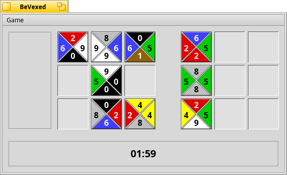

BeVexed
==
A maddeningly-addictive puzzle game.

If you've ever heard of a game called TetraVex, you will find this wonderful little time waster all too familiar. The concept is simple: put the tiles in the grid on the left such that the numbers match wherever 2 tiles touch.

Courtesy of the work of Scott McCreary and myself. If you would like to see a feature  or have a bug to report,  
please send e-mails to darkwyrm@gmail.com
